<h1 align="center">Frontend-Bet_Manager</h1>
A nOS distributed application to store and manage bets in a group of people ensuring that winners will always be payed

## Setup

This dApp uses nOs to connect to the Blockchain-powered Smart Economy.

First thing it is necessary to install and start [nOs client](https://github.com/nos/client):

**nOs client setup**
```
// Cloning from Github
git clone https://github.com/nos/client.git

// Install dependencies and launch the nOS client
// This is used to start developing on the nOS client
yarn install && yarn start
```
Second thing it is necessary to install and start this repository:

**bet_manager setup**
```bash
git clone https://github.com/MarcoBz/Frontend-Bet_Manager.git
cd Frontend-Bet_Manager
yarn install
yarn start
```

Third thing you need to build and import the bet_manager [smartcontract](https://github.com/MarcoBz/smartcontract-bet_manager) into your privatenet and change the *const scriptHash* in *index.js* file

## How it works

A Group with all possible participants at future bets needs to be created in the dApp inserting the name of the group and the NEO address of all of them.

When a bet is proposed, it has to be created in the dApp inserting its text, at least two possible results, the amount of tokens that has to be bet, the blocks length of all the periods in the bet's lifetime (they are described later) and it has to be checked or not if a player can add a new result.

Each person in the group can participate to the bet choosing one of the possible results and sending to the smartcontract the previously amount of tokens.

When the bet event ends, the result can be validated by all the participants in the group and if one result reaches 50 % + 1 of group participants, it is the winning result and winners can withdraw all the amount previously bet.

## Bet Lifetime

The lifetime of a bet consists in 4 steps:

<p align="center">
  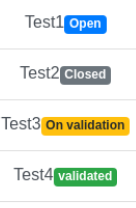
</p>

- **Open**: Period of time (calculated in block)  during  which everybody in the group can participate choosing one result and once the player has chosen it and the transaction is confirmed, he cannot change it. If the bet allows it, one player can also propose a new result inserting it in the proper field and choosing it. Choosing one result /////
- **Close**:  Period of time (calculated in block)  during  which the bet event takes place, no actions can be done.
- **OnValidation**:  Period of time (calculated in block)  during  which  everybody in the group can validate one result of the bet choosing it, until this period ends one player can change its validation. 
- **Validated**: Final step in bet life. If one result has been validated by at least 50 % + 1 of group participants, it is the winning result and winner players can withdraw all the amount previously bet. If there isn't any result validated by at least 50 % + 1 of group participants or nobody has chosen the winning one, every player can withdraw its own amount of tokens (refund).

## dApp Pages

**MAIN PAGE**

This is the main page of the dApp:

<p align="center">
  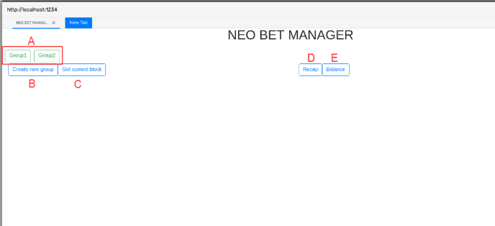
</p>

- **A** All the groups in which the logged adress at nOs is in. Choosing one of them allows the player to see group and bets information, create new bets, interact with existing bets.
- **B** Button to create a new group
- **C** Button to see the current block height 
- **D** Button to see a summary of the list of bets in which the player partecipated and their status
- **E** Button to see a summary of all payments and withdrawals (wins and refunds) of the player 

**GROUP CREATION PAGE**

This is the group creation page:

<p align="center">
  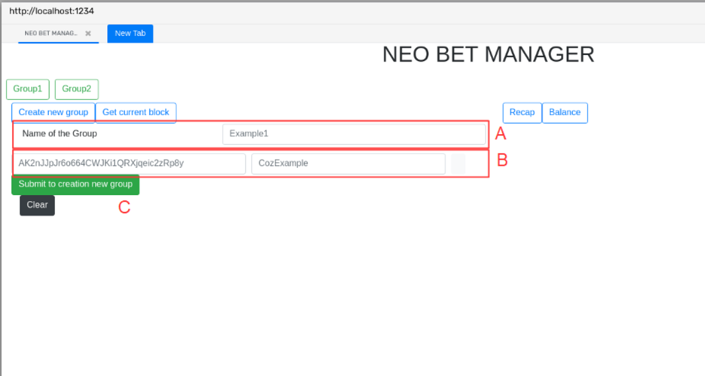
</p>

- **A** Group name
- **B** Participant address and nickname. A group has to have at least 3 participants and there must be no repetitions in addresses and nicknames, light button to confirm, dark button to delete.
- **C** Button to confirm the creation and to send the invocation transaction to the network

**GROUP PAGE**

This is the group page:

<p align="center">
  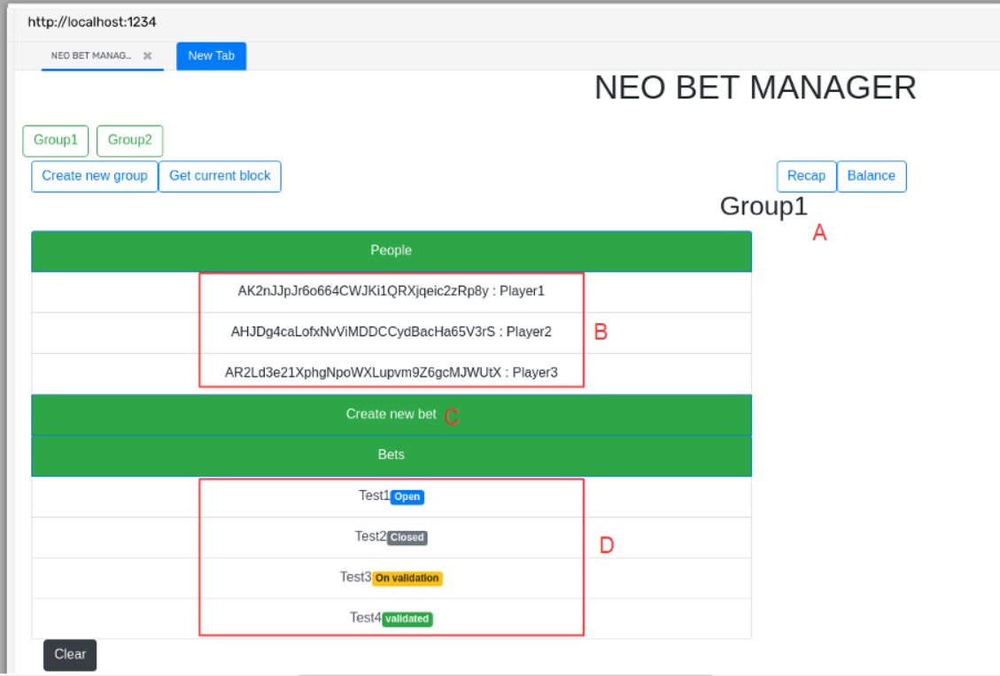
</p>

- **A** Group name
- **B** All participants in the group (addresses and nicknames)
- **C** All bets in the group and their status. Choosing one of them the bet details page will be displayed 
- **D** Button to create a new bet

**BET PAGE**

This is the bet details page:

<p align="center">
  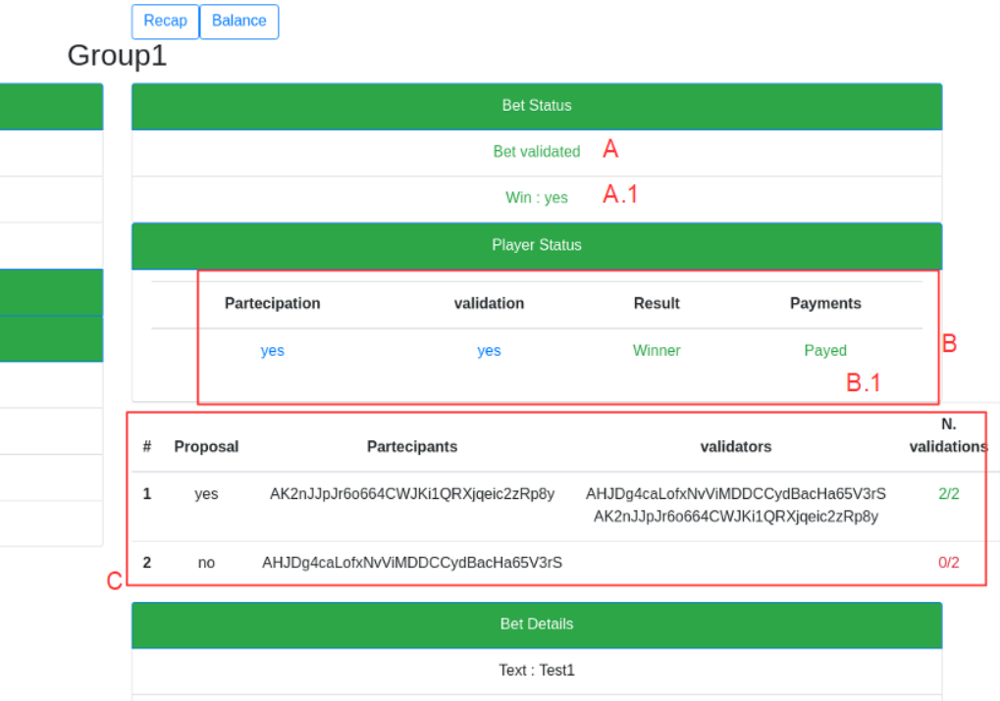
</p>
<p align="center">
  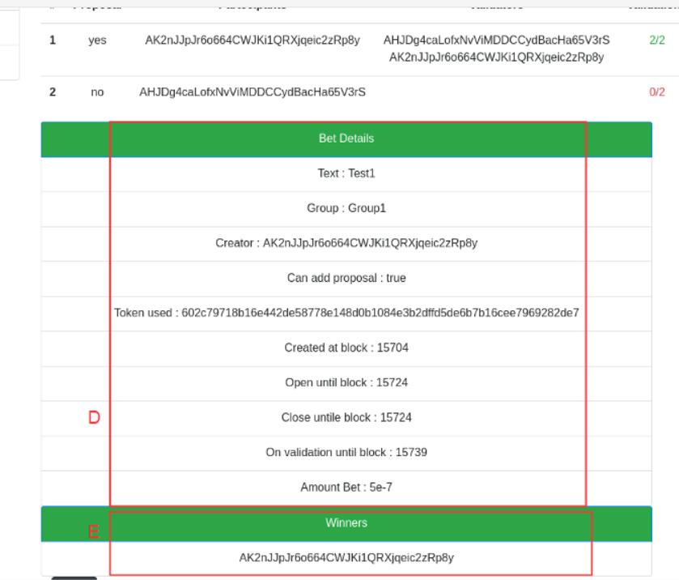
</p>
<p align="center">
  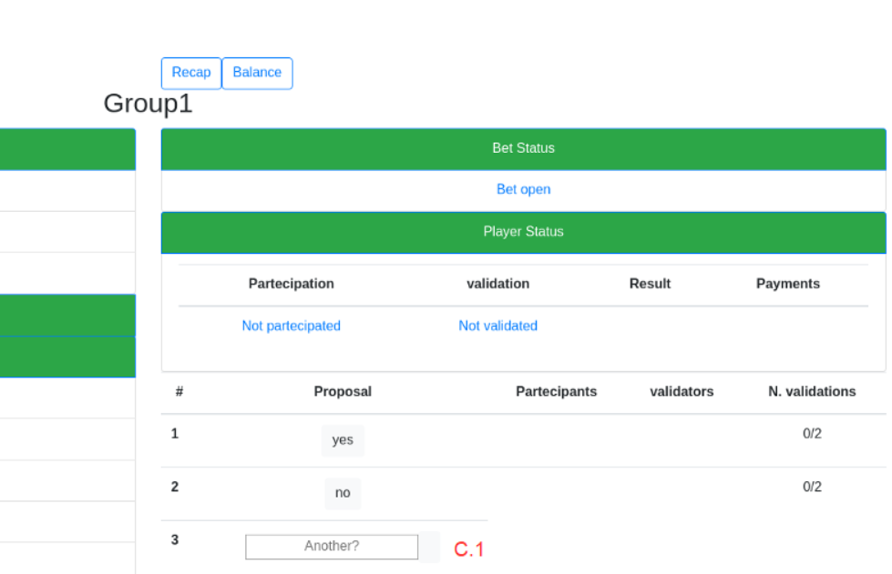
</p>

- **A** Bet status (open, close, onValidation, validated). If it has been validated it is also reported  if there is a winner result or all players will be refunded (**A.1**)
- **B** Table with summarized player status: which result he has chosen and validated, if he has won or lost, and the *payed* word if he has already withdraw his winning or refund  (**B.1** in the first figure), a button to withdraw winnings or refund if he is allowed (same as in the recap page) or nothing if the bet isn't validated yet or the player lost the bet (as in the third figure).
- **C** Results table: For each result there is reported which players have already chosen and/or validated it, the count of validation until the 50 % + 1 level and the button to actually participate or validate, this button send the invocation transaction to the network. In the end, if it is possible to add a result (**C.1** in the third figure), there is a field for the new proposal and a button to choose it.
- **D** Bet details (second figure)
- **E** Winners 

**BET CREATION PAGE**

This is the bet creation page:

<p align="center">
  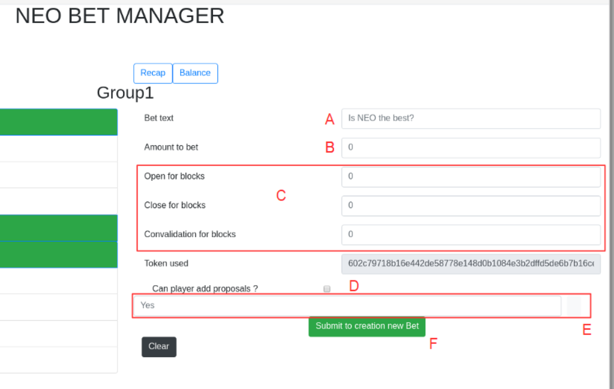
</p>

- **A** Bet text
- **B** Amount that has to be bet
- **C** Length in blocks for each step of the bet
- **D** Checkbox to allow or not to add new results by the players
- **E** Results of the bet. A bet has to have at least two results and there must be no repetitions in proposals, light button to confirm, dark button to delete.
- **F** Button to confirm the creation and to send the invocation transaction to the network

**RECAP PAGE**

This is the recap page:

<p align="center">
  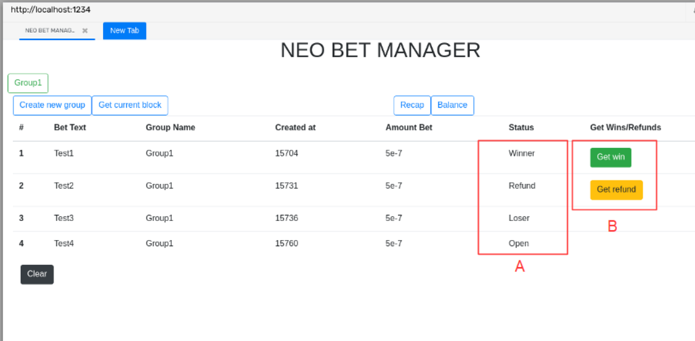
</p>

<p align="center">
  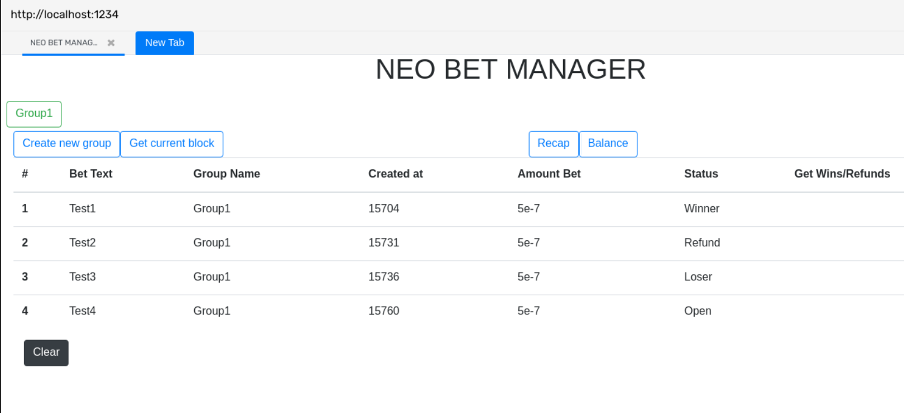
</p>

Each line is a bet in which the player has participate, reporting the bet status (**A**) and in the end a button to withdraw winnings or refund if he is allowed (**B** in the first figure), if the player is a winner he is allowed to be refunded and he has already withdraw the amount ther isn't any button (second figure). This is the same button that can be found in the bet details page clicking this button send the invocation transaction to the network.

**BALANCE PAGE**

This is the balance page: 

<p align="center">
  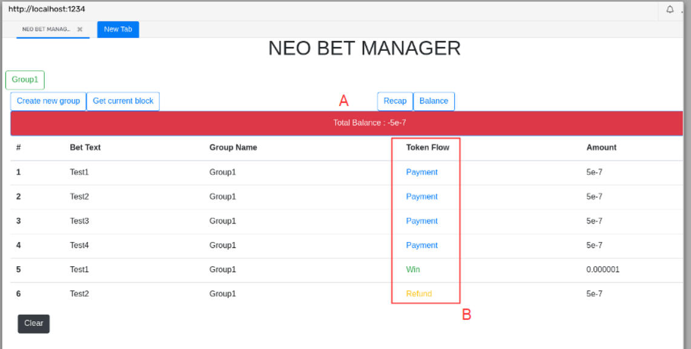
</p>

- **A** Total balance through all bets and all groups
- **B** Each line is a payment of a bet or the withdrawal of a winning of a refund reporting also some bet details

**BLOCK HEIGHT PAGE**

This is the block height page: 

<p align="center">
  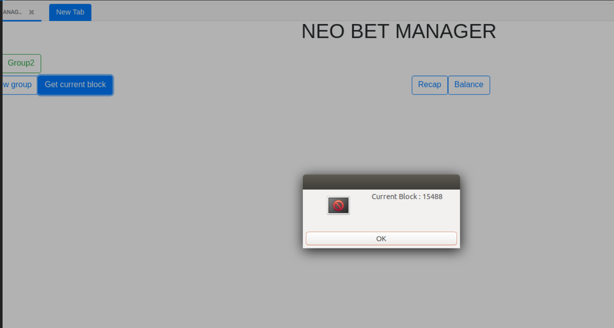
</p>

Shows the current block height

## Final Considerations

- The dApp is coded in Vanilla javascript and Jquery, I'm learning Vue.js in order to rewrite the code in a second moment
- Since this is just a PoC to see how the dApp works and I'm still learning how to manage verification scripts, send tokens and withdraw tokens, for this moment the smartcontract uses the storage as a database of all fictional transactions in order to have a total balance for each player. In future I'm going to implement real transactions of tokens to and from the smartcontract.
- I'm thinking to store all data using IPFS in order to have only to save the hashes into the storage
- Coded and tested using:
  * neo-python == 0.6.9
  * neo-boa == 0.4.2
  * nOs/client == 0.1.0
  * neo-core == 0.4.6
  * neo-privnet-with-gas and neo-scan [here](https://github.com/slipo/neo-scan-docker)


